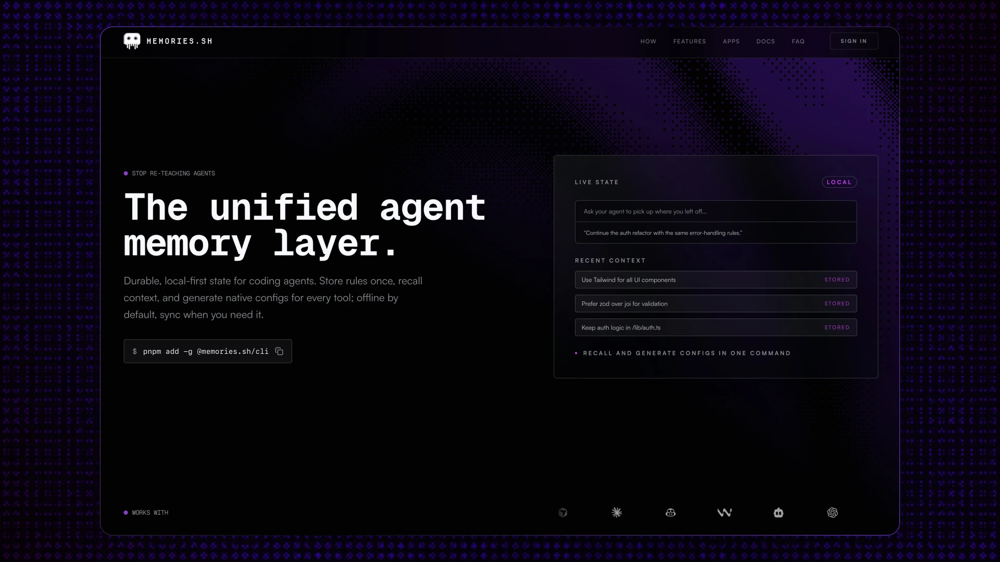

<p align="center">
  <a href="https://memories.sh">
    
  </a>
</p>

<p align="center">
  <a href="https://www.npmjs.com/package/@memories.sh/cli"></a>
  <a href="https://www.npmjs.com/package/@memories.sh/cli"></a>
  <a href="https://github.com/webrenew/memories/actions/workflows/ci.yml"></a>
  <a href="https://github.com/webrenew/memories/blob/main/LICENSE"></a>
  <a href="https://memories.sh/docs"></a>
  <a href="https://memories.sh"></a>
  <a href="https://github.com/webrenew/memories/issues"></a>
</p>

<p align="center">
  <b>Store rules once. Generate configs for every AI tool. Offline by default, sync when you need it.</b>
</p>

<p align="center">
  <a href="https://memories.sh/docs/getting-started">Getting Started</a> ·
  <a href="https://memories.sh/docs">Documentation</a> ·
  <a href="https://memories.sh">Website</a> ·
  <a href="https://www.npmjs.com/package/@memories.sh/cli">npm</a>
</p>

---

## Table of Contents

- [Why](#why)
- [Install](#install)
- [Quick Start](#quick-start)
- [Features](#features)
- [Supported Tools](#supported-tools)
- [Memory Types](#memory-types)
- [Memory Segmentation Lifecycle](#memory-segmentation-lifecycle)
- [Generation Pipeline](#generation-pipeline)
- [MCP Server](#mcp-server-fallback)
- [CLI Reference](#cli-reference)
- [Ingesting Existing Rules](#ingesting-existing-rules)
- [Development](#development)
- [Contributing](#contributing)
- [License](#license)

---

## Why

Every AI coding tool ships its own instruction format — `CLAUDE.md`, `.cursor/rules/`, `.github/copilot-instructions.md`, and on and on. Add a second tool and you're copy-pasting. Add a third and things drift.

**memories.sh** gives you one local database of memories and a two-step pipeline that generates the richest possible config for each tool:

```
Memory Store → .agents/ (canonical) → Claude, Cursor, Copilot, Windsurf, …
```

## Install

```bash
npm install -g @memories.sh/cli
```

Requires Node.js >= 20. Also available via `pnpm add -g @memories.sh/cli`.

Global installs automatically bootstrap `SKILLS.md` guidance in detected tool config homes (for example `~/.claude`, `~/.cursor`, `~/.codex`) so agents know when and how to call `memories`.

## Quick Start

```bash
# Initialize in your project (auto-detects tools, configures MCP, imports existing project skills)
memories setup

# Optional: force setup scope
memories setup --scope project   # or --scope global

# Add memories
memories add --rule "Always use TypeScript strict mode"
memories add --decision "Chose Supabase for auth — built-in RLS, generous free tier"
memories add --fact "API rate limit is 100 req/min per user"

# Path-scoped rules — only apply to matching files
memories add --rule "Use RESTful naming" --paths "src/api/**" --category api

# Generate configs for all detected tools
memories generate
```

## Features

- **One store, every tool** — add a memory once, generate native configs for 8+ tools
- **Local-first** — SQLite at `~/.config/memories/local.db`, works fully offline
- **Segmented lifecycle memory** — separate session, semantic, episodic, and procedural memory for stronger continuity
- **Path-scoped rules** — `--paths "src/api/**"` becomes `paths:` in Claude, `globs:` in Cursor
- **Skills** — define reusable agent workflows following the [Agent Skills](https://agentskills.io) standard
- **`.agents/` canonical directory** — tool-agnostic intermediate format, checked into git
- **Semantic search** — AI-powered embeddings find related memories, not just keyword matches
- **Relationship-aware graph retrieval** — traverses `similar_to`, `contradicts`, `supersedes`, and semantic edges (`caused_by`, `prefers_over`, `depends_on`, `specializes`, `conditional_on`) with confidence-aware ranking
- **Conflict surfacing** — `get_context` can return contradiction pairs so agents can ask clarification questions before acting
- **MCP server** — fallback MCP server for agents that need real-time access beyond static configs
- **Auto-setup** — `memories setup` (`init` alias) detects installed tools, configures MCP, and imports existing project skills automatically
- **Global SKILLS.md bootstrap** — installs cross-tool memory usage guidance into detected global agent config directories
- **Cloud sync** — optional sync via Turso embedded replicas (local speed, cloud backup)
- **GitHub capture queue** — ingest PRs/issues/commits via webhook and approve before writing memories
- **Import/Export** — ingest existing rule files, export to YAML for sharing

## Supported Tools

| Tool | Target | Output |
|------|--------|--------|
| **Cursor** | `cursor` | `.cursor/rules/*.mdc` |
| **Claude Code** | `claude` | `CLAUDE.md` + `.claude/rules/` + `.claude/skills/` |
| **Factory (Droid)** | `factory` | `.factory/instructions.md` |
| **GitHub Copilot** | `copilot` | `.github/copilot-instructions.md` |
| **Windsurf** | `windsurf` | `.windsurf/rules/memories.md` |
| **Gemini** | `gemini` | `GEMINI.md` |
| **Cline** | `cline` | `.clinerules/memories.md` |
| **Roo** | `roo` | `.roo/rules/memories.md` |
| **Amp / Codex / Goose / Kilo / OpenCode** | `agents` | `.agents/` |

## Memory Types

```bash
memories add --rule "Use early returns to reduce nesting"          # Always-active standards
memories add --decision "Chose Tailwind for utility-first approach" # Architectural choices
memories add --fact "Deploy target is Vercel with Edge Functions"   # Concrete project knowledge
memories add "Legacy API deprecated Q3 2026"                       # General notes (default)
memories add --type skill "..." --category deploy                  # Reusable agent workflows
```

## Memory Segmentation Lifecycle

memories.sh uses two complementary axes:

1. **Type**: `rule`, `decision`, `fact`, `note`, `skill` (what kind of memory it is)
2. **Lifecycle segment**: session, semantic, episodic, procedural (where memory lives over time)

Session and lifecycle commands:

```bash
# Explicit session lifecycle
memories session start --title "Checkout refactor"
memories session checkpoint <session-id> "Pre-compaction checkpoint"
memories session snapshot <session-id> --trigger auto_compaction

# Inactivity compaction worker
memories compact run --inactivity-minutes 60

# OpenClaw file-mode lifecycle (semantic + daily + snapshots)
memories openclaw memory bootstrap
memories openclaw memory flush <session-id>
memories openclaw memory snapshot <session-id> --trigger reset
```

Learn more:
- [Memory Segmentation](https://memories.sh/docs/concepts/memory-segmentation)
- [memories session](https://memories.sh/docs/cli/session)
- [memories compact](https://memories.sh/docs/cli/compact)
- [openclaw memory](https://memories.sh/docs/cli/openclaw-memory)

## Generation Pipeline

```bash
# Step 1: Write canonical .agents/ directory from memory store
memories generate agents

# Step 2: Adapt to specific tools (or let it auto-detect)
memories generate cursor    # .agents/ → .cursor/rules/
memories generate claude    # .agents/ → CLAUDE.md + .claude/
memories generate factory   # .agents/ → .factory/instructions.md
memories generate all       # detect tools, generate everything
```

The `.agents/` directory is the canonical, tool-agnostic intermediate:

```
.agents/
├── instructions.md           # Global rules, decisions, facts
├── rules/                    # Path-scoped rules with YAML frontmatter
│   ├── api.md
│   └── testing.md
├── skills/                   # Agent Skills standard (SKILL.md)
│   └── deploy/
│       └── SKILL.md
└── settings.json             # Permissions, hooks, env vars
```

## MCP Server (Fallback)

For agents that support MCP, the CLI includes a built-in server for real-time access when static configs aren't enough:

```bash
memories serve
```

Or configure in your tool's MCP settings:

```json
{
  "mcpServers": {
    "memories": {
      "command": "memories",
      "args": ["serve"]
    }
  }
}
```

**9 tools**: `get_context`, `add_memory`, `search_memories`, `get_rules`, `list_memories`, `edit_memory`, `forget_memory`, `bulk_forget_memories`, `vacuum_memories`

**3 resources**: `memories://rules`, `memories://recent`, `memories://project/{id}`

When using MCP outside the target repo directory, pass `project_id` on writes to force project scope:

```json
{
  "name": "add_memory",
  "arguments": {
    "content": "Use polling with exponential backoff",
    "type": "rule",
    "project_id": "github.com/webrenew/agent-space"
  }
}
```

Use `global: true` for user-wide memories (do not send both `global` and `project_id`).

## CLI Reference

| Command | Description |
|---------|-------------|
| `memories setup` | Initialize in current project, auto-detect tools, and import project skills |
| `memories add <content>` | Add a memory with type, tags, paths, category |
| `memories edit [id]` | Edit a memory (interactive picker or by ID) |
| `memories forget <id>` | Soft-delete a memory |
| `memories search <query>` | Full-text search (`--semantic` for embeddings) |
| `memories list` | List memories with optional filters |
| `memories recall` | Get context-aware memories for the current project |
| `memories session <subcommand>` | Manage explicit session lifecycle (`start`, `checkpoint`, `status`, `end`, `snapshot`) |
| `memories compact run` | Run inactivity compaction worker for active sessions |
| `memories openclaw memory <subcommand>` | Read/write OpenClaw semantic, daily, and snapshot files |
| `memories generate [target]` | Generate native config files |
| `memories ingest [source]` | Import from existing rule files |
| `memories diff` | Compare generated output against existing files |
| `memories serve` | Start the MCP server |
| `memories sync` | Sync local database with cloud |
| `memories hook` | Manage git hooks for auto-generation |
| `memories stats` | Show memory statistics |
| `memories doctor` | Check for common issues |

Full docs at [memories.sh/docs/cli](https://memories.sh/docs/cli).

## Ingesting Existing Rules

Already have rules scattered across tools? Import them:

```bash
memories ingest cursor           # .cursorrules, .cursor/rules/
memories ingest claude           # CLAUDE.md
memories ingest claude-rules     # .claude/rules/*.md (extracts paths)
memories ingest cursor-rules     # .cursor/rules/*.mdc (extracts globs)
memories ingest skills           # .agents/.claude/.cursor/.codex/... skills dirs
memories ingest --all            # scan everything
```

Directory-based ingestion preserves path scoping, categories, and skill metadata.

## Development

```bash
# Install dependencies
pnpm install

# Build all packages
pnpm build

# Type check
pnpm typecheck

# Lint
pnpm lint

# Run tests
pnpm test

# CLI watch mode
cd packages/cli && pnpm dev

# Web dev server
cd packages/web && pnpm dev
```

### Project Structure

```
memories/
├── packages/
│   ├── cli/                 # @memories.sh/cli — CLI + MCP server
│   │   ├── src/
│   │   │   ├── commands/    # CLI commands
│   │   │   ├── lib/         # Core: db, memory, markers, agents-generator, tool-adapters
│   │   │   └── mcp/         # MCP server implementation
│   │   └── package.json
│   ├── core/                # @memories.sh/core — typed client package
│   │   ├── src/
│   │   │   ├── client.ts
│   │   │   └── system-prompt.ts
│   │   └── package.json
│   ├── ai-sdk/              # @memories.sh/ai-sdk — AI SDK middleware + tools
│   │   ├── src/
│   │   │   ├── middleware.ts
│   │   │   └── tools.ts
│   │   └── package.json
│   └── web/                 # Next.js marketing site + dashboard
│       ├── src/
│       │   ├── app/         # App Router pages and API routes
│       │   ├── components/  # UI components (shadcn/ui)
│       │   └── lib/         # Auth, Stripe, Supabase, Turso clients
│       └── content/docs/    # Documentation (fumadocs)
├── .github/                 # CI, Dependabot
├── pnpm-workspace.yaml
└── package.json
```

### Tech Stack

**CLI**: TypeScript, Commander.js, libSQL/SQLite, MCP SDK, Zod, yaml

**SDK**: `@memories.sh/core` + `@memories.sh/ai-sdk` (TypeScript, fetch-based client, AI SDK middleware/tools)

**Web**: Next.js 16, React 19, Tailwind CSS v4, shadcn/ui, Supabase, Turso, Stripe, Framer Motion, fumadocs

## Contributing

Contributions are welcome. Please open an issue first to discuss what you'd like to change.

1. Fork the repo
2. Create your branch (`git checkout -b feat/my-feature`)
3. Commit your changes (`git commit -m 'feat: add my feature'`)
4. Push (`git push origin feat/my-feature`)
5. Open a Pull Request

CI runs lint, typecheck, tests, and build on every PR. All checks must pass before merging.

## License

[Apache 2.0](LICENSE)

---

<p align="center">
  <a href="https://memories.sh">memories.sh</a> ·
  <a href="https://memories.sh/docs">Docs</a> ·
  <a href="https://www.npmjs.com/package/@memories.sh/cli">npm</a> ·
  <a href="https://github.com/webrenew/memories">GitHub</a>
</p>
